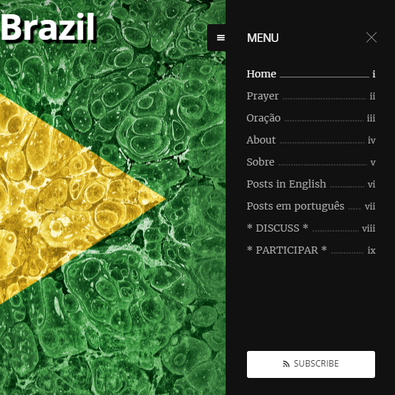

# WIGOIB (What Is Going On In Brazil)

## The Project

The project has three main components:

1. [**YouTube Channel**](https://www.youtube.com/channel/UCsbM9d9FpPh8LdfhxF-glvQ) - where video classes are published, containing the corresponding CC (closed captions) in English, and the respective subtitles in Portuguese.

2. [**Blog**](https://whatisgoingoninbrazil.com) - where the video classes are embedded together with their corresponding transcriptions, both in English and in Portuguese.

3. [**Forum**](https://discuss.whatisgoingoninbrazil.com) - the discussion platform for the blog's comments - reproducing both the English and Portuguese blog posts and providing a place for "[Civilized Discourse Construction](https://www.discourse.org)".

## The Blog

The blog is hosted in the [Ghost Pro](https://ghost.org) platform.

It contains a menu which leads to a couple of static pages: "[Prayer](https://whatisgoingoninbrazil.com/blog-opening-prayer/)" and "[About](https://whatisgoingoninbrazil.com/brazilian-citizen/)".

In this folder you find the sources for these.

## Menu

## O Projeto

O projeto tem três componentes principais:

1. [**Canal no YouTube**](https://www.youtube.com/channel/UCsbM9d9FpPh8LdfhxF-glvQ) - onde as vídeo aulas são publicadas, contendo as correspondentes legendas em Inglês e em Português.

2. [**Blog**](https://whatisgoingoninbrazil.com) - onde as vídeo aulas são publicadas em conjunto com suas respectivas transcrições, tanto em inglês quanto em português.

3. [**Forum**](https://discuss.whatisgoingoninbrazil.com) - a plataforma de debate que serve a seção de comentários do blog - reproduzindo os posts do blog em Inglês e em Português, e providenciando um espaço para "[Construção de Debate Civilizado](https://www.discourse.org/)".

## O Blog

O blog é hospedado na plataforma [Ghost Pro](https://ghost.org).

Ele contém um *menu* que leva a algumas páginas estáticas: "[Oração](https://whatisgoingoninbrazil.com/prece-de-abertura-do-blog/)" (Prayer) e "[Sobre](https://whatisgoingoninbrazil.com/cidadao-brasileiro/)" (About).

Nesta pasta você encontra as fontes para as mesmas.
